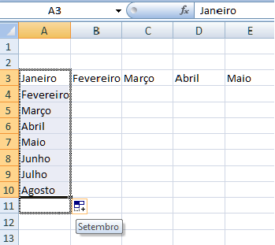
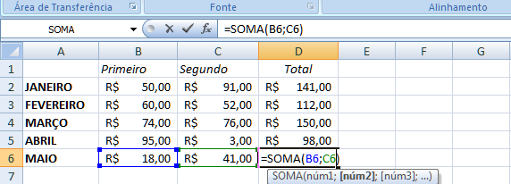
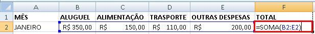
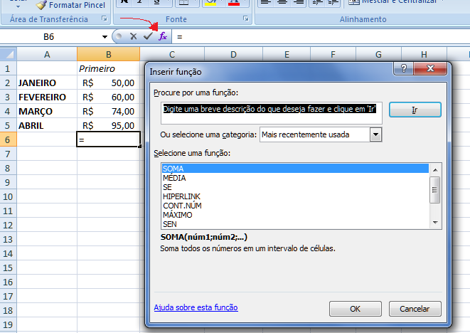
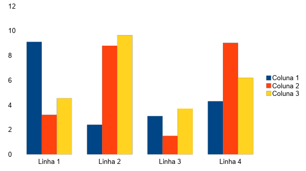

https://drive.google.com/file/d/1fDAPvWlFbyeUkQJNL_N79FI9LfjMokcA/view
# **Apostila Informática**

## Nível Intermediário

Apostila desenvolvida pelo PET Computação UFPR. Você pode alterar, adaptar, e criar a partir desse material para fins não comerciais.

### **Introdução**

Esse material foi elaborado pelo PET Computação UFPR para o projeto Desenvolvimento de Cursos de Capacitação em Informática para Imigrantes, servindo de material complementar para os alunos e bibliografia alternativa para o professor.

Os cursos de capacitação em informática para imigrantes tiveram início em 2014, vinculados ao projeto "Português Brasileiro para Migração Humanitária". Eles foram organizados a partir da necessidade, apresentada pelos próprios imigrantes, de dominar ferramentas computacionais básicas, tanto para uma melhor inserção no mercado de trabalho, quanto para manter contato com familiares e amigos que permaneceram em seus países de origem. Os cursos estão hoje estruturados como um projeto de extensão que tem como objetivo propor um processo formativo de capacitação em informática para imigrantes. Mas este projeto somente se justifica enquanto uma construção acadêmica enquanto parte do programa de extensão “Política Migratória e Universidade Brasileira", consolidando a iniciativa da UFPR em construir propostas de políticas públicas para a migração humanitária e para o papel das universidades públicas nestas políticas.

As aulas inicialmente foram assumidas por alunas e alunos do Programa de Educação Tutorial (PET) em Computação da UFPR, vinculados aos cursos de Bacharelado em Ciência da Computação e em Informática Biomédica. Ao longo do tempo incorporaram-se ao grupo petianas e petianos vinculados à programas da UTFPR. Hoje o grupo é bastante amplo e é composto por estudantes de diversos cursos da UFPR e da UTFPR da área de computação.

Atualmente, dois cursos são compreendidos no projeto. Um, de nível básico, que compreende uma iniciação ao uso do computador, para aqueles que não possuem conhecimento de informática e outro, de nível intermediário, voltado às principais ferramentas de edição de textos, planilha eletrônica e internet (correio eletrônico, web, redes sociais e aplicativos em nuvem). Em ambos níveis as aulas têm um caráter prático e são ministradas, em cada sala, por um professor e três a quatro monitores, que acompanham a realização dos exercícios propostos. 

**Contato:** [facebook.com/informaticaparaimigrantesufpr](https://www.facebook.com/informaticaparaimigrantesufpr/)

**Contato PET Computação UFPR:** [facebook.com/petcompufpr](facebook.com/petcompufpr)  

### **Sumário**
(em branco)

### **Tópico 01 – Revisão**

* **ÁREA DE TRABALHO OU DESKTOP**

É a área principal da tela do Sistema Operacional, que visualizamos quando o computador é iniciado. O papel de parede é a imagem que aparece ao fundo da área de trabalho e pode ser modificado para personalizar como o usuário desejar. Existem diversas maneiras para adicionar o papel de parede, entre elas:

1. Clique com o botão direito do mouse na área de trabalho → alterar plano de fundo, escolha a imagem e clique em salvar.

2. Localize uma imagem no computador ou internet, clique sobre ela com o botão direito do mouse, clique no item *Definir como plano de fundo da área de trabalho.*

 Quando o computador permanecer muito tempo sem uso a proteção de tela será ativada, para retornar ao uso normal basta movimentar o  mouse ou alguma tecla de direção (setas) do teclado.   
# **_FALTA IMAGEM AQUI_**

* Os *ícones* são **atalhos**, um meio rápido de acessar alguns programas.

* A *lixeira* é o local (pasta) onde se encontram as pastas e arquivos excluídos. Na lixeira temos duas opções: restaurar os itens ou esvaziar a lixeira. 
Para restaurar uma pasta/arquivo basta clicar na pasta/arquivo com o botão direito do mouse e escolher a opção *Restaurar*. 
Para esvaziar a lixeira procure a opção *Esvaziar Lixeira* na barra de ferramentas, clique e confirme se deseja excluir todos os itens definitivamente.

* *Janelas:* Todos os arquivos e programas são exibidos dentro de janelas, que são caracterizadas pelos seguintes itens: 

	* *Minimizar* – oculta a janela, deixando-a na barra de ferramentas.

  * *Maximizar* – deixa a janela no tamanho máximo da tela do monitor.

  * *Fechar* – fecha a janela, encerrando o programa.
# **_FALTA IMAGEM AQUI_**
* *O Menu Iniciar* é o principal elemento da barra de tarefas. Ele dá acesso a outros menus que, por sua vez, acionam programas do Sistema Operacional. Ao ser acionado, o botão Iniciar mostra um menu vertical com várias opções.
* A *Barra de Tarefas* contém o ícone para acessarmos o menu *Iniciar*, além de outros ícones de programas e também a informação de todas as janelas abertas no momento.

### **Tópico 2 – O EDITOR DE TEXTO**

O editor de texto é um programa para criar textos, cartas, documentos com imagens, tabelas ou gráficos. 

Se você está utilizando o sistema operacional Windows, um editor de texto disponível é o **Microsoft Word**. 
Se você está usando outro sistema você pode utilizar esse mesmo editor de modo online, para isso pesquise por **WORD ONLINE** no Google. 
O Word Online terá menos recursos e ferramentas que a outra versão.

Se você está utilizando o sistema operacional LINUX, um editor de texto é o **LibreOffice Writer**. 

Há vários editores de texto no mercado, mas em geral as funcionalidades são as mesmas, mudando apenas o *layout* dos ícones.

 Os componentes: 

* *Barra de Títulos:* Mostra o nome do aplicativo e o nome do arquivo que está sendo editado. 
Na extrema direita desta barra estão os botões de janela, demonstrados anteriormente.

* *Barra de Menus:* Lista de comandos e funções disponíveis no editor de texto.

* *Barra de Ferramentas:* Apresenta atalhos para as funções mais comuns do editor de texto.

* *Barra de Formatação:* Apresenta as principais opções de formatação do editor de texto.

* *Barra de Status:* Apresenta informações gerais sobre o arquivo.

**Barra de Menus:**

* **Arquivo:** Com a opção arquivo você pode criar um novo arquivo, abrir um arquivo já existente, salvar seu arquivo, entre outras funcionalidades. Diferença entre **SALVAR **e **SALVAR COMO: 	**

    1. **SALVAR:** Quando salvamos um arquivo pela primeira vez, podemos tanto clicar em salvar ou salvar como. O resultado é o mesmo: abre-se uma janela para escolher a pasta onde deseja salvar, coloca-se o nome do arquivo e clica em **SALVAR**.

    2. **SALVAR COMO:** É utilizado quando o arquivo já está salvo e você deseja duplicá-lo. Ao clicar em Salvar Como, abre-se uma nova janela para escolher outro lugar para salvar o arquivo e inserir o nome para ele. Assim, ficam salvos 2 cópias do mesmo arquivo, com as mesmas informações.

* **Editar:** Com a opção editar você pode desfazer ou refazer uma ação; copiar, recortar ou colar do texto; localizar uma palavra ou trecho do texto, entre outros.

* **Exibir:** Com a opção exibir você pode determinar o que será exibido na tela inicial do seu editor de texto.

* **Inserir:** Com a opção inserir você pode adicionar diversos elementos no seu arquivo, como imagens, formas, gráficos, etc.

* **Formatar:** Com a opção formatar você pode modificar a formatação do seu arquivo, alterando configurações de texto, espaçamento entre linhas, etc.

* **Estilos:** Com a opção estilos você pode alterar o formato de parte do seu arquivo como, por exemplo, adicionando uma citação ou título.

* **Tabela:** Com a opção tabela você pode inserir uma tabela no seu arquivo, sendo esta do tamanho que você desejar.

* **Ferramentas:** Com a opção ferramentas você pode selecionar qual idioma usar no corretor ortográfico do seu arquivo, contar quantas palavras há no seu arquivo, estruturar notas de rodapé, etc.

* **Janela:** Com a opção janela você pode abrir o arquivo em outra janela, fechar a janela atual e alternar entre janelas abertas.

* **Ajuda:** Com a opção ajuda você obter e pedir informações a respeito do editor de texto.

As funcionalidades das *Barras de Ferramentas e Formatação* serão trabalhadas ao longo do curso, mas de modo geral suas opções permitem personalizar o arquivo, além de também conter atalhos para funções disponíveis na *Barra de Menus*. 

**Formatando o texto:**

A formatação do texto permite que você faça alterações na aparência do texto como, por exemplo, mudar a fonte da letra, o tamanho, cor, etc.
Para formatar o texto você precisa primeiro selecionar a parte que deseja modificar e depois clicar na ferramenta desejada como 
*Tamanho da Fonte, Estilo (negrito, sublinhado, itálico), Cor da Fonte,* etc.
Além da personalização do texto, o editor de textos oferece também recursos como *Marcadores*, utilizados para listar elementos, *Alinhamentos* que são quatro opções para alinhar o texto e o *Espaçamento* que modifica o espaço entre as linhas do texto.

## Tópico 3 – O EDITOR DE PLANILHAS

O editor de planilhas é uma planilha eletrônica muito utilizada para: realizar cálculos matemáticos simples e complexos, armazenar e trabalhar com lista de dados, elaboração de relatórios e gráficos mais complexos, sendo recomendado para planejamentos, previsões, análises estatísticas e financeiras, simulações e manipulação numérica em geral.

Conceitos Iniciais:

As planilhas são constituídas por células organizadas em linhas e colunas.

  * As linhas são identificadas por números (1, 2, 3…).

  * As colunas são identificadas por letras (A, B, C…).

	* As células são identificadas pela junção da coluna por linha (A1, A2, B3…).

No exemplo abaixo você pode ver a identificação da célula, da linha e coluna:

	

O tamanho das linhas e colunas podem ser alterados colocando o mouse entre as linhas (na borda marcada) ou entre as colunas (também na borda marcada). Quando colocar entre os números ou entre as letras, irá aparecer um símbolo diferente. Se você der um duplo clique do botão esquerdo nesse momento, a linha ou coluna se ajustará com a célula de maior tamanho. Essa mudança de símbolos do mouse é uma característica muito importante do editor de planilhas.

Abaixo temos uma tabela para ajudar a entender melhor os símbolos que aparecem para o mouse no editor de planilhas e qual a função de cada um.

Outro símbolo muito importante é o último dessa tabela. O nome dessa função é "alça de preenchimento automático". Quando cria-se uma fórmula que irá utilizar várias vezes ou quando tem um padrão (qualquer que seja), como datas, sequência de números, entre outros, basta utilizar essa ferramenta. Quando estiver com aquele símbolo aparecendo, precisa-se apenas clicar em cima e puxar até onde deseja e na direção necessária. O editor de planilhas permite colocar essa sequência na mesma coluna ou na mesma linha. No exemplo abaixo vemos que o editor de planilhas reconhece inclusive os meses e, quando puxamos nessa “alça”, temos todos os meses (em sequência).

O editor de planilhas oferece as mesmas ferramentas de formatação que o editor de textos ofertava no módulo de edição de planilhas.

**TRABALHANDO COM O EDITOR DE PLANILHAS**

* **Fórmulas: **Umas das mais importantes ferramentas do editor de planilha são as fórmulas. Para melhor entendimento das fórmulas é necessário se familiarizar com os símbolos matemáticos.

		

<table>
  <tr>
    <td>SINAL</td>
    <td>FUNÇÃO</td>
  </tr>
  <tr>
    <td>+</td>
    <td>SOMAR</td>
  </tr>
  <tr>
    <td>-</td>
    <td>SUBTRAÇÃO</td>
  </tr>
  <tr>
    <td>*</td>
    <td>MULTIPLICAÇÃO</td>
  </tr>
  <tr>
    <td>/</td>
    <td>DIVISÃO</td>
  </tr>
  <tr>
    <td>^</td>
    <td>EXPONENCIAÇÃO</td>
  </tr>
  <tr>
    <td>=</td>
    <td>IGUALDADE</td>
  </tr>
</table>

Para se usar uma fórmula no editor de planilhas é preciso inserir o símbolo de** =**, indicando ao editor que você deseja trabalhar com fórmulas. Após o símbolo de igualdade é preciso inserir o nome da operação que você quer fazer, vamos usar como exemplo a operação de SOMA:

No exemplo acima, após inserir o nome da fórmula é preciso abrir parênteses e, dentro dos parênteses, determinar o intervalo das células com as quais você pretende realizar a operação. Para selecionar o intervalo você pode digitar ou clicar em cima da célula desejada. Para pegar apenas duas células quaisquer, coloca-se o sinal de ponto e vírgula **; **e para somar uma sequência de células, coloca-se a identificação da primeira célula seguido do sinal de dois pontos **: **e a identificação da última célula. Veja este último caso no exemplo abaixo:

Para se explorar mais fórmulas do editor de planilhas basta clicar no símbolo de **f(x) **, indicado pela seta em vermelho:

**GRÁFICOS:**

Um gráfico é uma representação visual dos dados. Utilizando elementos como colunas ( em gráficos de colunas) ou linhas (em gráficos de linhas), um gráfico exibe uma série de dados numéricos em um formato gráfico.  Um gráfico mostra uma visão geral, para que seja possível analisar dados e buscar tendências relevantes.

